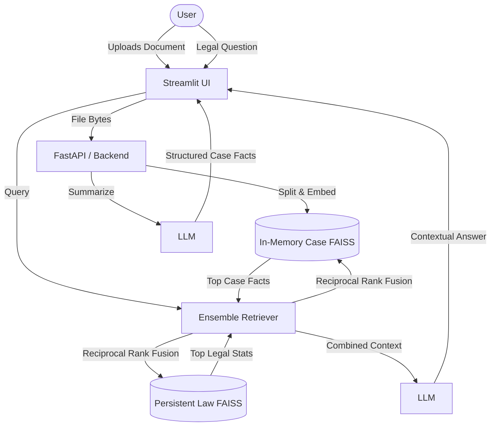

# ⚖️ NomoSys – Dual-RAG Legal Assistant

NomoSys is an advanced AI-powered legal assistant designed specifically for **Indian Law**. 

It uses Retrieval-Augmented Generation (RAG) to provide factual, highly accurate legal information based on the Indian Constitution and other penal codes (BNS, CrPC). It also functions completely offline to protect sensitive legal documents.

With the brand-new **Dual-RAG upgrade**, NomoSys now allows users to upload their own case documents (like FIRs, court judgments, or legal contracts). The system analyzes the document to extract key facts (parties, timeline, issues) and then seamlessly merges the case facts with the general legal knowledge base to answer highly contextualized legal questions.

---

## 🎯 Problem Statement
General large language models (LLMs) often hallucinate legal advice or mistakenly apply foreign laws (like US statutes) to Indian cases. Furthermore, general RAG systems can answer hypothetical questions about the law but fail when a user needs to apply the law to a specific set of facts in their own documents. Finally, uploading sensitive legal documents to cloud-based AI systems poses significant privacy and confidentiality risks.

## 💡 Motivation
The motivation behind NomoSys is to build a privacy-first, locally-hosted legal intelligence tool that empowers citizens, law students, and junior advocates. By grounding the AI directly in Indian statutes and allowing private document analysis through a local Dual-RAG pipeline, NomoSys democratizes access to legal information while ensuring zero data leakage.

---

## 🚀 Features

* **📖 Persistent Legal Knowledge Base**: Query the Indian Constitution, BNS, and other acts.
* **📤 Case Document Analysis**: Upload PDFs and TXT files (e.g., FIRs, agreements).
* **🧠 Automated Fact Extraction**: Automatically extracts parties, timeline, evidence, and relief sought from documents.
* **🔀 Dual-RAG Architecture**: Asks questions combining specific uploaded case facts with permanent legal statutes.
* **🌐 Multilingual Support**: Query and receive answers in 12 Indian languages (Hindi, Telugu, Tamil, Kannada, etc.).
* **🔒 Privacy-First**: Can run 100% locally with Ollama (Llama 3.2), meaning case details never leave your machine.
* **🔗 Reciprocal Rank Fusion (RRF)**: Intelligently merges search results from the case document and the law base.
* **⚡ FastAPI Backend**: Clean separation between backend logic and UI, ready for deployment.
* **🎨 Interactive UI**: Built with Streamlit for a smooth chat and document upload experience.

---

## 🏗️ System Architecture

### Existing Architecture
The original NomoSys architecture consisted of a single RAG pipeline:
1. `data/constitution.pdf` chunked and embedded via `paraphrase-multilingual-MiniLM-L12-v2`.
2. Stored in a persistent FAISS index on disk.
3. User asks a question → Vector search finds relevant constitutional articles.
4. LLM answers the question based on those articles.

### Upgraded Dual-RAG Architecture
The upgraded architecture introduces an in-memory document pipeline parallel to the permanent legal pipeline.



---

## 🛠️ Tech Stack

| Component | Technology | Description |
|-----------|------------|-------------|
| **Frontend** | Streamlit | Python-based UI framework for the chat and uploader |
| **Backend API** | FastAPI | High-performance API server with Pydantic validation |
| **Vector Database** | FAISS | Facebook AI Similarity Search (faiss-cpu) |
| **Embeddings** | HuggingFace | `sentence-transformers/paraphrase-multilingual-MiniLM-L12-v2` |
| **Orchestration** | LangChain | For chains, prompts, and EnsembleRetriever |
| **Local LLM** | Ollama | Runs local models like `llama3.2:3b` |
| **Translation** | deep-translator | Uses Google Translate API under the hood |
| **Testing** | Pytest | Unit and integration testing |

---

## ⚙️ Installation & Setup

### Prerequisites
1. **Python 3.10+**
2. **Ollama**: Download and install from [ollama.com](https://ollama.com).
3. Pull the default model: 
   ```bash
   ollama run llama3.2:3b
   ```

### Step-by-Step Setup
1. **Clone the repository:**
   ```bash
   git clone https://github.com/KarthikMaiya/NomoSys.git
   cd NomoSys
   ```

2. **Create a virtual environment:**
   ```bash
   python -m venv .venv
   source .venv/bin/activate  # On Windows: .venv\Scripts\activate
   ```

3. **Install dependencies:**
   ```bash
   pip install -r requirements.txt
   ```

4. **Add Legal Data:**
   Ensure `data/constitution.pdf` (or any other `.txt`/`.pdf` legal documents) is present in the `data/` folder. The persistent FAISS index will be built automatically on first run.

---

## 🔧 Environment Variables

Set these in your terminal or a `.env` file before running:

| Variable | Default | Description |
|----------|---------|-------------|
| `LLM_PROVIDER` | `ollama` | Engine to use (`ollama` or `openai`). |
| `OLLAMA_MODEL` | `llama3.2:3b` | The local model to use. |
| `OLLAMA_NUM_CTX` | `4096` | Context window size. |
| `NOMOSYS_API_URL` | None | API URL if running Streamlit remotely. |
| `OPENAI_API_KEY` | None | Required only if using `LLM_PROVIDER=openai`. |

---

## 📖 Usage Guide

You can run NomoSys in two ways: Standalone UI or API+UI mode.

### Option 1: Standalone UI (Recommended for local use)
Run the Streamlit app directly. It will spin up the backend logic internally.
```bash
streamlit run app.py
```

### Option 2: API Server + UI
Start the FastAPI server:
```bash
uvicorn api_server:app --reload --port 8000
```
Then, in another terminal, tell Streamlit to use the API:
```bash
export NOMOSYS_API_URL="http://localhost:8000"
streamlit run app.py
```

### How to use the app:
1. **Chat Only**: Type a question in the chat box to query the Indian Constitution.
2. **Document Analysis**: Click the **Upload** expander in the sidebar. Upload an FIR or contract. Click **Analyze Document**.
3. **Dual-RAG**: Once analyzed, ask a question like *"Based on the uploaded document, what sections apply?"*

---

## 🧪 Example Queries

* **Without Document**: *"What are the fundamental rights guaranteed under Article 21?"*
* **Without Document (Hindi)**: *"भारतीय संविधान के अनुच्छेद 14 के बारे में बताएं" (Tell me about Article 14 of the Indian Constitution)*
* **With FIR Uploaded**: *"Who is the complainant in this FIR and what was stolen?"*
* **With Contract Uploaded**: *"If Party A breaks Clause 3 of this agreement, what legal remedies does Party B have under the Indian Contract Act?"*

---

## 🌐 API Documentation

The FastAPI backend exposes the following endpoints:

* `GET /healthz` - Health check.
* `POST /upload` - Upload a document (PDF/TXT) via `multipart/form-data`. Returns a summary.
* `DELETE /case` - Clears the current case document from memory.
* `GET /case` - Returns whether a case is loaded and its summary.
* `POST /chat` - Expects JSON `{"question": "...", "history": []}`. Returns `{"answer": "...", "target_lang": "en"}`.

---

## ⚡ Performance & Limitations

* **Memory**: The system requires at least 8GB of RAM to run Ollama and the FAISS indices smoothly.
* **Limitations**: 
  - Scanned PDFs (images) are not supported as `PyPDFLoader` requires selectable text.
  - The in-memory case database is bound to the server session; restarting the server clears uploaded documents.

---

## 👨‍💻 Contributors

Built by **Karthik Maiya**.

---

## ⚠️ Disclaimer
NomoSys provides legal *information* only, not legal advice. It is a research and educational project. Always verify important legal references independently and consult a qualified legal professional before making legal decisions.
